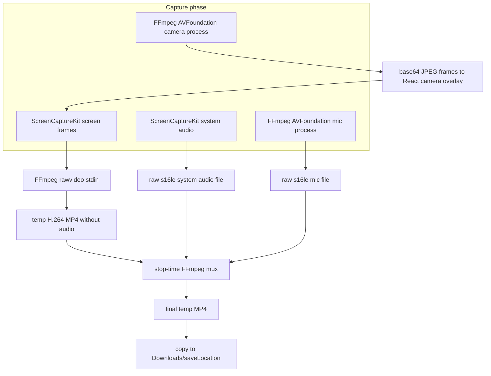
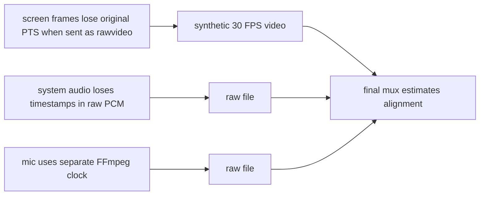
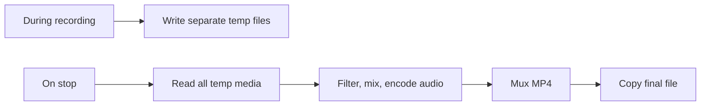
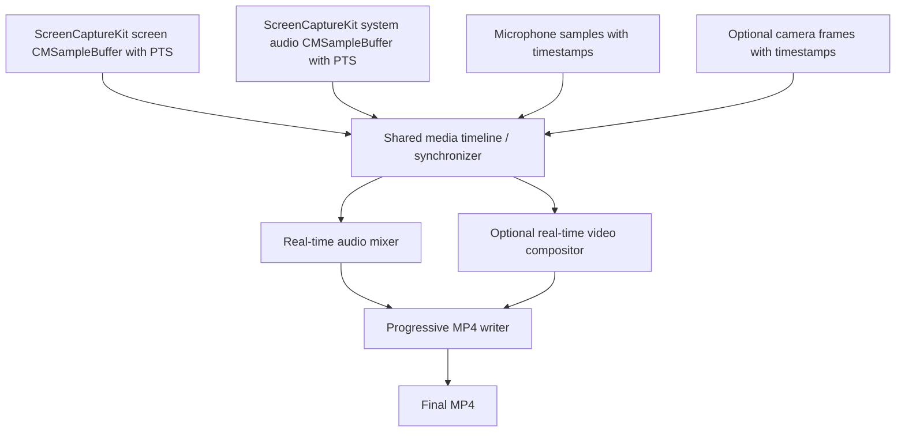
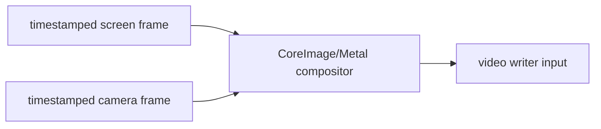

# Improve Synchronization and Stop-Time Saving

This document describes the two main architecture issues that currently prevent Momentum from being a production-ready long-form screen recorder:

1. stream synchronization is not deterministic enough
2. final saving work scales with recording duration

It also proposes a concrete migration plan from the current architecture to a timestamp-first, progressively written recording pipeline.

## Current Architecture Summary

Current recording is implemented mostly under:

- `src-tauri/src/services/recording.rs`
- `src-tauri/src/services/camera.rs`
- `src-tauri/src/services/platform/screencapturekit_recorder/`

The current pipeline is:



Important current details:

- Screen video is encoded during recording, but FFmpeg assigns timestamps from a synthetic `-r 30` input rate.
- System audio is captured from ScreenCaptureKit and written as raw PCM.
- Microphone audio is captured by a separate FFmpeg AVFoundation process and written as raw PCM.
- Camera preview is not a real output video stream. It appears in the final video only because the camera overlay window is visible and captured as part of the screen.
- Stop runs a final FFmpeg command to align, mix, encode audio, and mux the final MP4.

## Issue 1: Synchronization Is Not Deterministic

### What Happens Today

The app combines streams that do not share one reliable timestamp pipeline.

#### Screen Video

Screen frames arrive from ScreenCaptureKit as `CMSampleBuffer`s with presentation timestamps. The current code reads the pixel buffer and writes raw BGRA bytes to FFmpeg:

```text
ScreenCaptureKit CMSampleBuffer -> raw BGRA bytes -> FFmpeg stdin
```

The FFmpeg input is configured like this:

```text
-f rawvideo -pix_fmt bgra -s WIDTHxHEIGHT -r 30 -i pipe:0
```

That means FFmpeg timestamps frames based on frame order at exactly 30 FPS. It does not receive the original ScreenCaptureKit PTS for each frame.

If ScreenCaptureKit delivers frames at exactly 30 FPS forever, this is acceptable. If frames arrive late, are skipped, bursty, or throttled, the encoded video duration can drift away from real elapsed capture time.

#### System Audio

System audio comes from the same ScreenCaptureKit stream, so it is conceptually close to screen timing. But the current implementation writes converted PCM samples to a separate raw file and later aligns the file using first-arrival timing:

```text
ScreenCaptureKit system audio -> Float32 -> s16le -> raw file
```

The raw file has no timestamps. Once written, the only timing information left is:

- assumed sample rate
- sample count
- first-arrival marker captured by Rust

#### Microphone Audio

Microphone audio is captured by a separate FFmpeg process:

```text
FFmpeg avfoundation mic -> s16le stdout -> raw file
```

This process has its own startup delay and clock behavior. It is not driven by the ScreenCaptureKit timeline. The mux step estimates offset from first arrival and estimates drift from sample count versus approximate video duration.

#### Camera Preview

The camera is another separate FFmpeg process:

```text
FFmpeg avfoundation camera -> MJPEG stdout -> base64 Tauri event -> React img -> captured as screen pixels
```

`CameraSyncHandle` tries to emit camera frames according to screen PTS ticks, but the final recording captures whatever the webview has painted by the time ScreenCaptureKit captures the screen. The pipeline includes FFmpeg camera latency, JPEG encoding, Rust parsing, base64 encoding, Tauri event dispatch, React state updates, image decode, and webview paint timing.

This is useful for a live overlay, but it is not a deterministic compositing pipeline.

### Why This Happens

The current design uses post-hoc synchronization:



The mux step tries to repair the timeline using:

- first screen frame arrival time
- first system audio arrival time
- first mic audio arrival time
- audio sample counts
- approximate video duration from frame count / requested FPS

That is not the same as preserving per-sample/per-frame timestamps from capture to final output.

### Why This Is a Product Problem

For a short recording, small timing errors might be barely noticeable. For a long recording, small assumptions can accumulate into visible problems:

- microphone audio can slowly drift from screen action
- system audio can feel slightly early or late
- camera overlay can feel delayed or jittery
- pauses can create unexpected timeline behavior because the code drops writes rather than representing gaps on a formal media timeline
- CPU load or display refresh changes can make video timing less predictable

A production screen recorder needs predictable sync. Users will notice a presenter voice that slowly moves out of alignment with clicks, cursor movement, UI actions, or system audio.

## Issue 2: Stop-Time Saving Scales With Recording Duration

### What Happens Today

Stopping a recording is not just flushing and closing a final file.

Current stop flow in `stop.rs`:

1. Stop the ScreenCaptureKit stream.
2. Sleep briefly so callbacks can finish.
3. Close video and system-audio writers.
4. Wait for video FFmpeg to finish.
5. Stop mic FFmpeg if running.
6. Compute offsets and duration estimates.
7. Run `mux_final_video`.
8. Remove temporary files.
9. Return final temporary output path.
10. Copy final temporary output to Downloads or `saveLocation`.

The final mux has to read the temp video and raw audio files and produce a new MP4. It applies filters such as:

- audio delay or trim for alignment
- mic tempo correction
- mic gain
- system/mic mixing
- async resampling
- trim to approximate video duration
- limiting
- AAC encoding

### Why This Happens

The current architecture defers audio encoding, audio mixing, and final container creation until stop.



Because muxing and audio processing happen at stop, stop time grows with recording duration.

A one-minute recording has one minute of raw audio to process. A two-hour recording has two hours of raw audio to process.

### Why This Is a Product Problem

For a production recorder, pressing stop should be safe and bounded:

- a one-minute recording and a two-hour recording should both finalize quickly
- the app should not appear hung
- a crash during finalization should not lose the whole recording
- disk usage should not balloon with multiple full-size intermediate files
- users should not have to wait minutes after a long recording before the file exists

The current design has higher risk for long recordings:

- large temporary raw audio files
- final mux can fail after a long session
- final output requires extra disk space
- stop duration is proportional to recording length
- current fallback is weak because temp cleanup happens before final output verification/fallback recovery is fully safe

## Target Architecture

The target architecture should be timestamp-first and progressively written.



Properties we want:

- preserve real timestamps from capture to output
- use one authoritative timeline
- encode and mux progressively while recording
- stop only flushes encoders and finalizes container metadata
- no duration-proportional post-processing step
- avoid long-lived raw temp audio files
- recover as much as possible after failures

## Recommended Direction: Native macOS Writer

Because the app is macOS-first and already uses ScreenCaptureKit, the best production direction is a native pipeline based on:

- ScreenCaptureKit for screen frames and system audio
- AVFoundation for microphone and optional camera capture
- AVAssetWriter for progressive MP4/MOV writing
- AVAudioEngine or AudioConverter/AudioQueue style logic for timestamped audio capture and mixing
- optional CoreImage/Metal/AVVideoComposition-style compositing if camera should be baked into the video

This avoids forcing FFmpeg raw pipes to carry timing data they do not naturally have.

An FFmpeg-based progressive writer is possible, but it is more fragile from Rust because:

- passing per-frame PTS into FFmpeg over raw pipes is awkward
- multiple live pipe inputs require careful backpressure management
- dynamic pause/mute/mix behavior becomes filter-graph complexity
- error handling across multiple child processes is harder

The native macOS direction is more work initially, but it matches the data model: timestamped sample buffers in, timestamped writer inputs out.

## Concrete Migration Plan

### Phase 0: Stabilize and Measure the Current Pipeline

Before replacing the pipeline, add measurement so regressions are visible.

Actions:

1. Add structured recording diagnostics.
   - session id
   - selected display dimensions
   - screen frame count
   - dropped or skipped video frame estimate
   - first/last screen PTS
   - first/last system audio PTS when available
   - system audio sample count
   - mic sample count
   - final mux duration
   - final file size

2. Add long-recording test protocol.
   - 1 minute smoke recording
   - 10 minute sync recording
   - 60 minute endurance recording
   - 120 minute disk and stop-time test

3. Add manual sync test media.
   - display a visual metronome/click marker
   - play system click sound
   - speak or clap into mic
   - verify alignment in the produced file

4. Fix the current mux fallback.
   - do not delete temp files before final output is verified
   - if mux fails, preserve temp files and emit their paths
   - only cleanup after verified success

This phase does not solve the architecture, but it creates a baseline and reduces data-loss risk.

### Phase 1: Make Screen Video Timestamp-Correct

The first real sync fix is to stop losing ScreenCaptureKit video timestamps.

Current problem:

```text
CMSampleBuffer PTS -> discarded -> FFmpeg assumes frame N at N/30 seconds
```

Target:

```text
CMSampleBuffer PTS -> writer input presentationTime
```

Actions:

1. Create a new backend abstraction:

```rust
trait MediaWriter {
    fn start(&self, output_path: &Path, config: WriterConfig) -> AppResult<()>;
    fn append_screen_sample(&self, sample: ScreenSample) -> AppResult<()>;
    fn append_system_audio_sample(&self, sample: AudioSample) -> AppResult<()>;
    fn append_mic_audio_sample(&self, sample: AudioSample) -> AppResult<()>;
    fn finish(&self) -> AppResult<PathBuf>;
}
```

2. Add a new recorder implementation beside the existing one.
   - keep current implementation as `legacy` during migration
   - introduce `timestamped_recorder` or `asset_writer_recorder`

3. Implement screen-only AVAssetWriter path first.
   - accept ScreenCaptureKit `CMSampleBuffer`
   - use the sample buffer PTS as the writer presentation time
   - write a playable screen-only MP4 or MOV progressively
   - stop should only call `markAsFinished` and `finishWriting`

4. Compare output duration.
   - actual elapsed recording time
   - first-to-last ScreenCaptureKit PTS duration
   - final file media duration

Acceptance criteria:

- 10 minute screen-only recording duration matches actual elapsed time within a small tolerance.
- Stop time is near constant and does not scale meaningfully with duration.
- No final FFmpeg mux is required for screen-only output.

### Phase 2: Add System Audio on the Same Timeline

System audio comes from the same ScreenCaptureKit stream, so it should be the easiest audio stream to make timestamp-correct.

Actions:

1. Preserve audio sample timestamps from ScreenCaptureKit.
   - use each audio `CMSampleBuffer` presentation timestamp
   - append to an audio writer input with that timestamp

2. Avoid raw PCM temp files.
   - encode audio progressively into the final container
   - use AVAssetWriter audio input settings for AAC

3. Implement system-audio mute in real time.
   - if muted, either write silence with the same timestamps or apply zero gain before appending
   - do not drop audio buffers when muted, because dropping can alter the timeline

4. Implement pause semantics explicitly.
   Choose one product behavior:
   - paused time is removed from the final video, or
   - paused time remains as frozen/silent timeline

   For a screen recorder, the likely desired behavior is that paused time is removed. If so, implement a timeline mapper:

```text
capture PTS -> subtract accumulated paused duration -> output PTS
```

Acceptance criteria:

- screen + system audio stay aligned over 60 minutes
- mute does not change audio duration
- pause/resume does not create audio/video drift
- stop remains near constant

### Phase 3: Replace FFmpeg Microphone Capture With Timestamped Native Capture

The microphone is currently the riskiest stream because it is captured by an independent FFmpeg process.

Actions:

1. Capture microphone using a native macOS API.
   Options:
   - AVAudioEngine input node
   - AVCaptureSession audio output
   - AudioQueue/CoreAudio for lower-level control

2. Attach timestamps to microphone audio.
   - derive from host time when buffers arrive
   - convert host time to the same timeline used for ScreenCaptureKit
   - account for device latency if the API exposes it

3. Resample mic audio if necessary.
   - target 48 kHz
   - target channel layout needed by the mixer

4. Mix mic and system audio during recording.
   - avoid post-stop `amix`
   - use a real-time audio mixer that consumes timestamped buffers
   - produce one output audio stream for the writer

5. Implement mic mute as silence insertion, not buffer dropping.
   - muted mic should contribute silence on the timeline
   - source disabled means no mic stream from the start

6. Remove mic `atempo` stop-time correction.
   - drift should be handled by timestamped capture/resampling during recording

Acceptance criteria:

- mic + screen alignment remains stable over 60 minutes
- mic + system audio alignment remains stable over 60 minutes
- stop time remains near constant
- no mic raw temp file is produced

### Phase 4: Decide the Correct Camera Product Model

The current camera model is a preview overlay captured by the screen recorder. That is easy but not robust.

There are two possible production models.

#### Option A: Overlay Capture Model

Keep the current product behavior: camera is an overlay window, and if it is visible, it appears in the screen recording.

Improvements:

- keep camera preview purely a UI feature
- do not pretend it is synchronized as a media stream
- document that immersive mode hides it from the recording
- reduce overhead by replacing base64 JPEG events with a more efficient preview path if possible

Pros:

- simpler
- matches current UX
- no compositor needed

Cons:

- camera latency depends on webview rendering
- not frame-perfect
- hidden overlay means no camera in output

#### Option B: Real Composited Camera Model

Capture camera as a timestamped native stream and composite it into the screen video before writing.

Pipeline:



Actions:

1. Capture camera with AVFoundation instead of FFmpeg.
2. Preserve camera sample timestamps.
3. Maintain a small timestamped camera frame buffer.
4. For each screen frame, choose the camera frame closest to the screen frame output PTS.
5. Composite camera into the screen pixel buffer.
6. Write the composited frame to the video writer.
7. Keep the React camera overlay only as a preview/control surface, not as the source of truth.

Pros:

- deterministic camera-in-output behavior
- camera can remain in output even if UI overlay is hidden
- better sync and visual consistency

Cons:

- more implementation work
- requires video compositing path
- more GPU/CPU engineering

Recommendation:

- For production recording correctness, choose Option B if camera-in-recording is a core feature.
- If camera is only a convenience overlay, choose Option A and explicitly document the limitation.

### Phase 5: Progressive Final File Writing

Once screen/audio are timestamped, eliminate duration-proportional stop-time muxing.

Actions:

1. Write directly to the final target or to a recoverable in-progress file.
   - examples:
     - `momentum-recording-<timestamp>.mp4.inprogress`
     - `momentum-recording-<timestamp>.mov`
   - rename atomically after successful finalization

2. Encode while recording.
   - video encoded progressively
   - final mixed audio encoded progressively
   - no raw full-duration temp audio files

3. On stop:
   - stop capture inputs
   - drain pending buffers
   - mark writer inputs finished
   - finalize container
   - rename file
   - emit `recording-saved`

4. Emit progress only for actual finalization if needed.
   - `recording-stopping`
   - `recording-finalizing`
   - `recording-saved`

5. Add crash recovery.
   - on app start, scan for `.inprogress` files
   - either offer recovery or cleanup based on whether the container is playable
   - never silently delete large unfinished recordings without a recovery policy

Acceptance criteria:

- stop time is roughly constant for 1 minute, 60 minutes, and 120 minutes
- final file appears in target location immediately after finalization
- app crash during recording leaves an inspectable/recoverable artifact
- no full-length raw audio temp files remain after the new pipeline is enabled

## Suggested Code Organization

Introduce new modules without deleting the old pipeline immediately.

```text
src-tauri/src/services/recording.rs
src-tauri/src/services/platform/
  mod.rs
  legacy_screencapturekit_recorder/
  timestamped_recorder/
    mod.rs
    writer.rs
    timeline.rs
    screen.rs
    system_audio.rs
    microphone.rs
    audio_mixer.rs
    camera.rs
    compositor.rs
```

Suggested responsibilities:

| Module | Responsibility |
| --- | --- |
| `timeline.rs` | Convert capture PTS/host time into output timeline, account for pause removal. |
| `writer.rs` | Own AVAssetWriter or equivalent progressive writer. |
| `screen.rs` | Receive ScreenCaptureKit screen samples and append timestamped video. |
| `system_audio.rs` | Receive ScreenCaptureKit audio samples and feed mixer/writer. |
| `microphone.rs` | Native mic capture with timestamps. |
| `audio_mixer.rs` | Mix system and mic into one output stream. |
| `camera.rs` | Native camera capture if choosing composited camera. |
| `compositor.rs` | Composite camera over screen frames if needed. |

Keep `Recorder` as the frontend-facing facade. It should not expose whether the implementation is legacy FFmpeg muxing or new timestamped writing.

## API and UI Changes

Most frontend APIs can stay stable:

- `start_recording`
- `pause_recording`
- `resume_recording`
- `stop_recording`
- `recording-started`
- `recording-paused`
- `recording-resumed`
- `recording-stopped`
- `recording-saved`
- `recording-error`

But the semantics should become stronger:

- `recording-stopped` should mean capture has stopped and finalization has started.
- `recording-saved` should mean the progressively written file has been finalized and renamed.
- Stop should not trigger long post-processing.

Consider adding:

- `recording-finalizing` for the short writer finalization window
- `recording-recovery-found` if crash recovery is added

## Implementation Risks

### Rust and Objective-C/Swift Interop

AVAssetWriter and AVFoundation capture APIs are Objective-C frameworks. The current Rust code already uses some macOS FFI, but a full native writer may be easier to implement in Swift or Objective-C and call from Rust.

Practical options:

1. Keep Rust orchestration, implement media engine in Swift.
   - Rust calls Swift bridge functions.
   - Swift owns ScreenCaptureKit, AVFoundation, AVAssetWriter.
   - Tauri commands remain Rust-facing.

2. Implement everything in Rust FFI.
   - fewer languages at runtime
   - more unsafe code and framework binding work

Recommendation:

- Use a Swift media engine bridge if the native writer path gets large.
- Keep the Tauri command/service API in Rust.

### MP4 Finalization

MP4 files need metadata finalization. Even with progressive writing, stop is not literally zero work. The goal is bounded finalization, not no finalization.

If crash recovery is important, consider whether MOV is safer during capture and export/rename behavior is acceptable for the product.

### Backpressure

The new pipeline must handle writer backpressure.

Rules:

- never block ScreenCaptureKit callbacks indefinitely
- use bounded queues
- decide a frame dropping policy for video under overload
- never drop audio silently unless pause semantics require it
- emit recording errors if writer inputs cannot keep up

## Done Criteria

The project can consider these two issues fixed when:

1. A 60-minute recording has stable screen/system/mic sync.
2. A 120-minute recording stops and saves in roughly the same time class as a 1-minute recording.
3. Stop no longer runs a full-duration mux/filter process.
4. Raw full-duration audio temp files are not required.
5. Video timestamps come from capture timestamps, not synthetic fixed frame count.
6. Mute and pause do not create drift.
7. Camera behavior is explicitly chosen:
   - overlay-only and documented, or
   - native timestamped compositing into the output.
8. Crash/failure handling preserves recoverable artifacts instead of deleting the only useful temp files.

## Recommended First Engineering Sprint

The first sprint should not try to solve every stream.

Concrete first milestone:

1. Add diagnostics and fix temp cleanup/fallback safety in the current pipeline.
2. Prototype a new screen-only timestamped writer.
3. Prove that a 10-minute screen-only recording:
   - has correct duration
   - finalizes quickly
   - does not require a final FFmpeg mux
4. Then add ScreenCaptureKit system audio on the same writer timeline.

That milestone validates the core architecture before investing in native microphone capture, audio mixing, and camera compositing.
