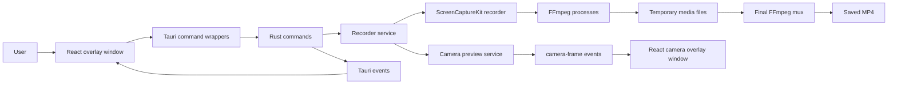

# Momentum Documentation

Momentum is a macOS-first desktop screen recorder built with Tauri, Rust, React, TypeScript, and FFmpeg. The app presents small always-on-top overlay windows while Rust coordinates screen, system audio, microphone, and camera preview capture.

This documentation reflects the implementation in this repository, not only the product intent in `README.md` or `_AGENT/`.

## Start Here

- [Architecture](./architecture.md) explains the main processes, windows, Rust services, and state ownership.
- [Recording Pipeline](./recording-pipeline.md) is the deep dive into screen, system audio, microphone, webcam preview, pause, mute, sync, and muxing.
- [Frontend and Backend Contract](./frontend-backend-contract.md) documents the Tauri commands, events, and frontend state model.
- [Platform Notes](./platform-notes.md) covers macOS dependencies, permissions, FFmpeg, and the Swift AVFoundation resolver.

## High-Level Shape

## Important Current Behaviors

- Screen video and system audio are captured through ScreenCaptureKit.
- Microphone audio is captured by a separate FFmpeg `avfoundation` process.
- Camera is captured by a separate FFmpeg `avfoundation` process for preview frames only. There is no independent camera track in the output file.
- The webcam appears in the final recording only as a visible overlay window captured by the screen recorder.
- Stop is not just "close the file": Rust stops the capture, finalizes temporary files, then runs a final FFmpeg mux to build the MP4.
- Start and stop Tauri commands return immediately after spawning backend work. The frontend learns the actual result through events such as `recording-started`, `recording-saved`, and `recording-error`.

## Main Source Files

- Frontend entry and window routing: `src/App.tsx`
- Overlay controls: `src/components/recording/ControlBar.tsx`
- Tauri command wrappers: `src/tauri/commands.ts`
- Tauri event wrappers: `src/tauri/events.ts`
- App bootstrap and managed state: `src-tauri/src/lib.rs`
- Rust command handlers: `src-tauri/src/commands/mod.rs`
- Recorder service: `src-tauri/src/services/recording.rs`
- Camera preview and camera sync: `src-tauri/src/services/camera.rs`
- ScreenCaptureKit recorder: `src-tauri/src/services/platform/screencapturekit_recorder/`
- FFmpeg locator: `src-tauri/src/services/platform/macos/ffmpeg.rs`
- AVFoundation resolver: `src-tauri/resources/resolve_avf.swift`
