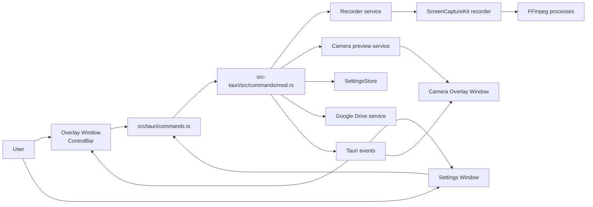

# Momentum Documentation

Momentum is a macOS-first desktop recorder built with Tauri, Rust, React, TypeScript, and FFmpeg.

This folder is intended for engineers onboarding to the codebase. It documents what exists today in code, how the pieces fit, and where to make changes safely.

## Reading Order for New Developers

1. [Architecture](./architecture.md)
2. [Frontend and Backend Contract](./frontend-backend-contract.md)
3. [Recording Pipeline](./recording-pipeline.md)
4. [Google Drive Integration](./google-drive.md)
5. [Platform Notes](./platform-notes.md)
6. [Dangers](./DANGERS%20%E2%9D%8C.md)

## System At A Glance

## Current Product Behaviors (Implemented)

- Overlay control bar is vertical, centered right, always on top, and non-focusable.
- Settings window is a dedicated floating webview that is focusable and draggable.
- Mic/camera selection is persisted, with fallback to available devices when stored IDs become invalid.
- Immersive mode hides overlay windows at runtime and is toggleable from menu + global hotkey.
- Recording finalization can upload to Google Drive and emit upload lifecycle events.
- Upload completion is gated on Drive video readiness before share-success event emission.

## Source Map

Core frontend:

- `src/App.tsx`
- `src/windows/OverlayWindow.tsx`
- `src/components/recording/ControlBar.tsx`
- `src/windows/SettingsWindow.tsx`
- `src/windows/CameraOverlayWindow.tsx`

Frontend Tauri boundary:

- `src/tauri/commands.ts`
- `src/tauri/events.ts`
- `src/types/index.ts`

Core backend:

- `src-tauri/src/lib.rs`
- `src-tauri/src/commands/mod.rs`
- `src-tauri/src/models.rs`
- `src-tauri/src/services/settings.rs`
- `src-tauri/src/services/recording.rs`
- `src-tauri/src/services/camera.rs`
- `src-tauri/src/services/google_drive.rs`
- `src-tauri/src/services/platform/screencapturekit_recorder/`
