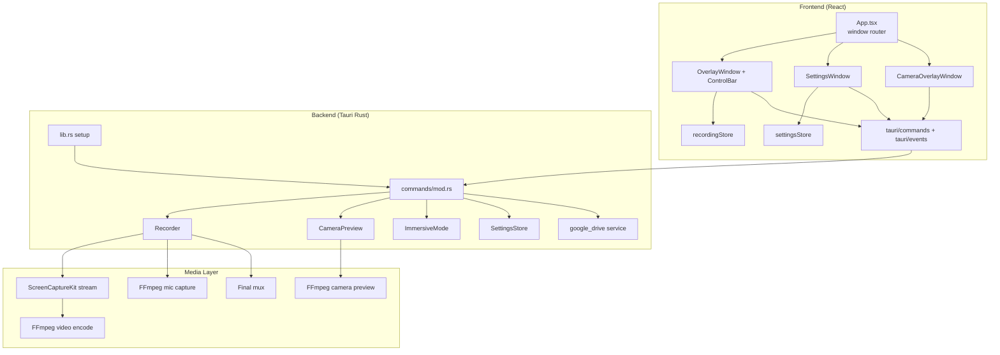
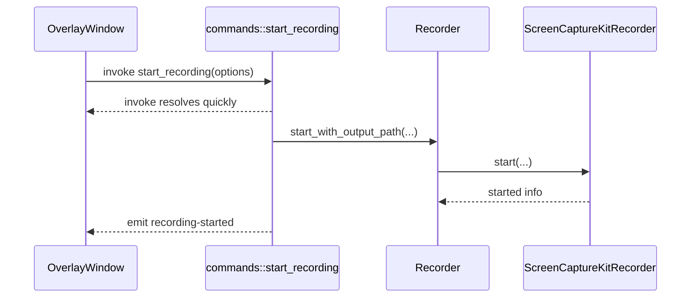
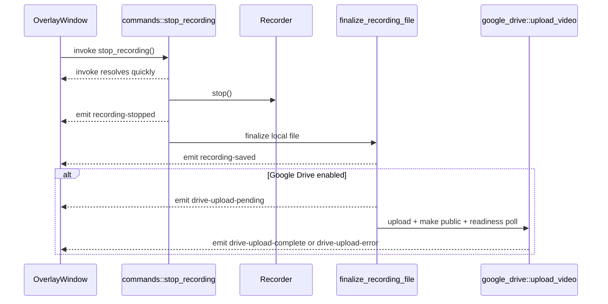
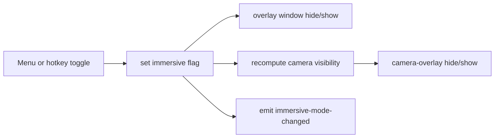

# Architecture

Momentum is a multi-window desktop app with a React UI layer and a Rust-native media backend.

## High-Level Components

## Window Model

Defined in `src-tauri/tauri.conf.json`:

- `overlay` (`88x330`): main recording controls, non-focusable, always-on-top.
- `camera-overlay` (`200x200`): live webcam preview surface, non-focusable.
- `settings` (`700x760`): focusable floating settings UI.

`src/App.tsx` inspects window label (`getCurrentWindow().label`) and renders the matching root component.

## Why The Windows Behave Differently

- Overlay/camera are non-focusable so users can interact quickly without stealing app focus in normal use.
- Settings is focusable so text/select inputs are editable.
- Settings is draggable via `data-tauri-drag-region` on shell-only regions; interactive controls explicitly disable drag region.

## Backend State Ownership

Managed in `lib.rs` via `app.manage(...)`:

- `Recorder`: recording lifecycle + elapsed timer task + start/stop/pause/resume facade.
- `Mutex<CameraPreview>`: camera preview FFmpeg process and frame emission.
- `Arc<Mutex<ImmersiveMode>>`: runtime immersive flag.
- `SettingsStore`: persisted JSON settings source of truth.

This keeps React as orchestration/UI and Rust as execution/state authority for media operations.

## Core Flows

### 1) Recording Flow

### 2) Stop + Finalize + Upload Flow

### 3) Settings Flow

- `SettingsWindow` loads three resources in parallel on mount:
  - persisted settings (`get_settings`)
  - canonical defaults (`get_default_settings`)
  - capture devices (`list_capture_devices`)
- UI keeps `draft`, `committed`, and `defaults` state.
- `Save settings` persists `draft`.
- `Reset to defaults` applies backend defaults and device resolution fallback.

## Immersive Mode Behavior

Immersive mode is runtime-only. The persisted setting is not "immersive on/off"; persisted setting is the shortcut and webcam-hide preference while immersive is active.
