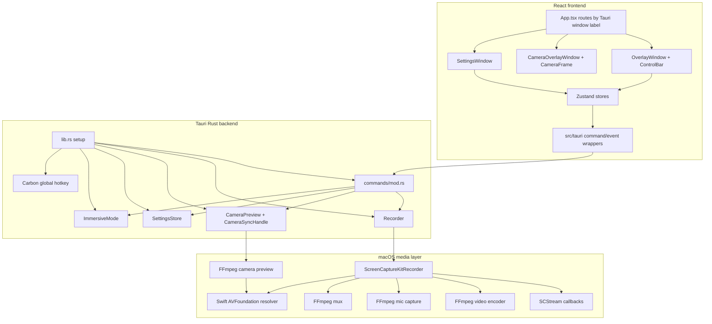
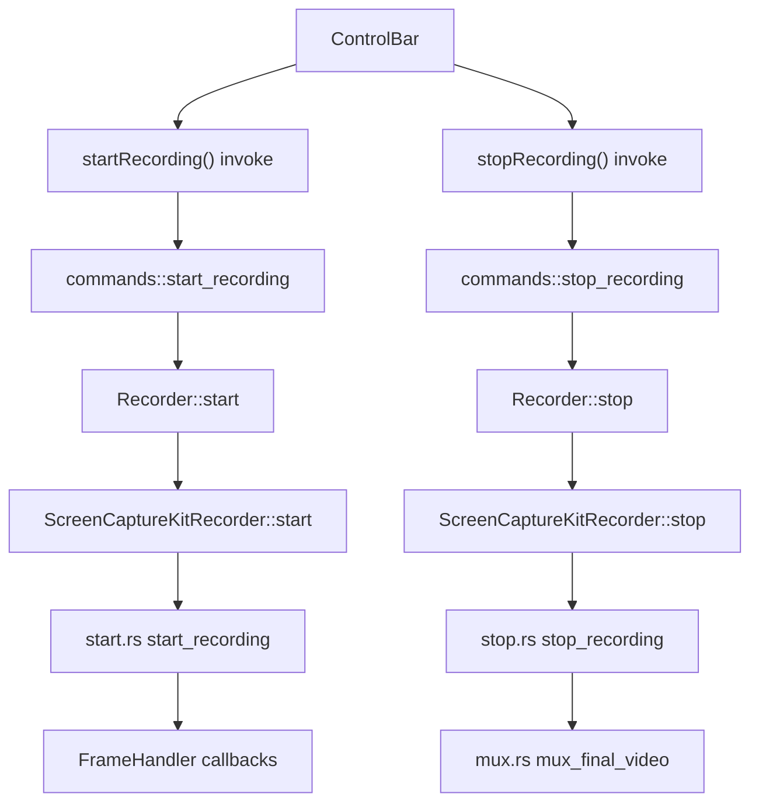

# Architecture

Momentum is a single Tauri application with multiple webview windows and a Rust backend that owns all native recording work.

## Runtime Components

## Windows

Tauri defines three windows in `src-tauri/tauri.conf.json`.

| Window label | React component | Purpose |
| --- | --- | --- |
| `overlay` | `OverlayWindow` | Always-on-top control bar for record, pause, stop, mute, and camera toggle. |
| `camera-overlay` | `CameraOverlayWindow` | Circular draggable webcam preview overlay. Hidden until camera is enabled. |
| `settings` | `SettingsWindow` | Settings UI, currently focused on immersive-mode shortcut configuration. |

`src/App.tsx` calls `getCurrentWindow()` and renders the correct window UI based on the label. This means the same React bundle serves all windows.

## Backend State Ownership

Rust state is registered in `lib.rs` during Tauri setup:

| Managed state | Type | Responsibility |
| --- | --- | --- |
| Recorder | `Recorder` | User-facing recording lifecycle, elapsed clock, and delegation to ScreenCaptureKit recorder. |
| Camera preview | `Mutex<CameraPreview>` | FFmpeg camera preview process and frame emission. |
| Immersive mode | `Arc<Mutex<ImmersiveMode>>` | Whether overlay windows should be hidden. |
| Settings | `SettingsStore` | JSON settings persisted under the OS config directory. |

The command layer in `src-tauri/src/commands/mod.rs` is an orchestration layer. It accepts Tauri invokes, calls services, updates windows, and emits events back to React.

## Recording Service Layers

`Recorder` is the public recording facade. It protects higher-level state such as "is recording", "is paused", elapsed time, output path, and whether mic/camera were included at start. It does not directly process media buffers.

`ScreenCaptureKitRecorder` owns platform recording state. It starts the ScreenCaptureKit stream, FFmpeg processes, raw writers, mute flags, pause flag, counters, temporary paths, and final mux.

## Settings and Immersive Mode

Settings are persisted as JSON by `SettingsStore`. Current settings:

- `micEnabled`: whether microphone capture should be included when recording starts.
- `cameraEnabled`: whether camera preview overlay should be shown and included visually in screen capture.
- `immersiveShortcut`: global shortcut string, default `Option+I`.
- `saveLocation`: optional output directory; otherwise recordings are copied to Downloads.

Immersive mode is runtime state, not persisted as an enabled setting. When enabled, it hides the control overlay and camera overlay. Recording continues normally.

The global shortcut uses Carbon APIs in `services/hotkey.rs`. Updating the shortcut changes both the app menu accelerator and the Carbon hotkey registration.

## Output Ownership

Recording first writes a final temporary MP4 path under the OS temp directory, then `commands::save_recording_file` copies it to the configured save location or Downloads using the file name `momentum-recording-<unix_seconds>.mp4`.

This means there are two levels of temporary output:

1. ScreenCaptureKit recorder temp files used during capture and muxing.
2. Recorder-level temporary final MP4 copied into the user-visible output directory.
