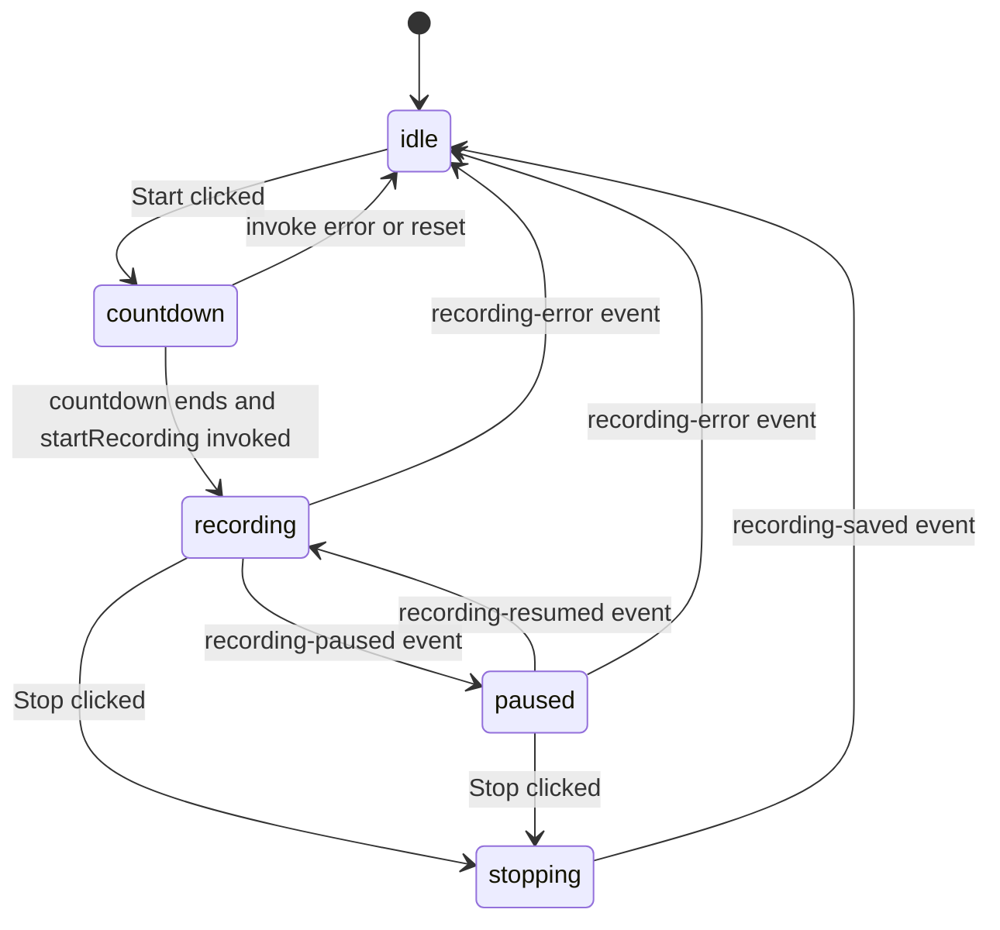

# Frontend and Backend Contract

The frontend talks to Rust through Tauri commands and listens for Tauri events. Commands are wrapped in `src/tauri/commands.ts`; events are wrapped in `src/tauri/events.ts`.

## Command Pattern

Start and stop commands are intentionally asynchronous fire-and-emit operations.

For example, `start_recording` immediately spawns backend work and returns `Ok(())` to the invoke caller. The real result is emitted later as either:

- `recording-started`
- `recording-error`

The same applies to `stop_recording`, which emits:

- `recording-stopped`
- `recording-saved`
- `recording-error`

Frontend code should not assume that an `invoke()` resolving means media capture has successfully started or finished.

## Commands

| TypeScript wrapper | Rust command | Notes |
| --- | --- | --- |
| `startRecording(options)` | `start_recording` | Starts background recording task. Result is event-driven. |
| `pauseRecording()` | `pause_recording` | Synchronous pause of active recorder. Emits `recording-paused`. |
| `resumeRecording()` | `resume_recording` | Synchronous resume. Emits `recording-resumed`. |
| `stopRecording()` | `stop_recording` | Starts background stop and save task. Result is event-driven. |
| `getSettings()` | `get_settings` | Loads persisted settings or defaults. |
| `updateSettings(settings)` | `update_settings` | Saves settings and emits `settings-updated`. |
| `setCameraOverlayVisible(visible)` | `set_camera_overlay_visible` | Shows/hides camera overlay and starts/stops preview. |
| `toggleImmersiveMode()` | `toggle_immersive_mode` | Flips runtime immersive mode. |
| `setImmersiveMode(enabled)` | `set_immersive_mode` | Sets runtime immersive mode. |
| `toggleMicrophoneDuringRecording(enabled)` | `toggle_microphone_during_recording` | Currently always returns an error. Source inclusion cannot change mid-recording. |
| `setMicMuted(muted)` | `set_mic_muted` | Updates backend mic mute flag. |
| `setSystemAudioMuted(muted)` | `set_system_audio_muted` | Updates backend system audio mute flag. |
| `updateImmersiveShortcut(shortcut)` | `update_immersive_shortcut` | Updates settings, app menu accelerator, and Carbon hotkey registration. |

## Events

| Event | Payload | Meaning |
| --- | --- | --- |
| `recording-started` | `{ startedAtMs, elapsedMs }` | Backend capture started successfully. |
| `recording-paused` | `{ elapsedMs }` | Backend paused writing media. |
| `recording-resumed` | `{ elapsedMs }` | Backend resumed writing media. |
| `recording-stopped` | `{ elapsedMs }` | Backend capture stopped. File may not be copied to final location yet. |
| `recording-saved` | `{ path }` | Final recording was copied to user-visible location. |
| `recording-error` | `{ message }` | Recording lifecycle error. |
| `recording-elapsed` | `{ elapsedMs }` | Periodic timer update from Rust. |
| `camera-frame` | `CameraFrame` | Base64 JPEG preview frame for camera overlay. |
| `camera-error` | `{ message }` | Camera preview error. |
| `settings-updated` | `AppSettings` | Persisted settings changed. |
| `immersive-mode-changed` | `{ enabled }` | Runtime immersive mode changed. |
| `immersive-shortcut-updated` | `{ shortcut }` | Shortcut was changed. |

## Frontend State

`src/state/recordingStore.ts` owns transient UI state:

- `recordingState`: `idle`, `countdown`, `recording`, `paused`, or `stopping`
- `elapsedTimeMs`
- `countdownSecondsRemaining`
- `isMicMuted`
- `isSystemAudioMuted`
- `errorMessage`

`src/state/settingsStore.ts` mirrors persisted settings:

- `micEnabled`
- `cameraEnabled`
- `immersiveShortcut`
- `saveLocation`

The overlay loads settings on mount and subscribes to recording events. The camera overlay separately subscribes to `camera-frame` events.

## Recording UI Flow



The control bar optimistically sets the state to `recording` after the countdown before the backend emits `recording-started`. The event then confirms and sets elapsed time. Errors reset the store.

## Camera Toggle Flow

The camera button does two things:

1. Calls `setCameraOverlayVisible(newValue)` so Rust shows/hides the overlay and starts/stops FFmpeg preview.
2. Calls `updateSettings({ ...settings, cameraEnabled: newValue })` so the choice persists.

During recording, camera visibility is also affected by immersive mode. If immersive mode is enabled, `apply_camera_overlay_visibility` hides the camera window even when camera is enabled.

## Settings Flow

Settings are loaded from Rust instead of local storage. The persisted file lives under the OS config directory:

```text
<config_dir>/momentum/settings.json
```

Rust emits `settings-updated` after saving. All windows listen for that event through the shared `App.tsx` subscription and update the Zustand settings store.

## Implementation Cautions

- Keep TypeScript DTOs in `src/types/index.ts` aligned with Rust DTOs in `src-tauri/src/models.rs`.
- Do not add raw `invoke` calls in components; use `src/tauri/commands.ts`.
- Do not assume camera frames imply camera is recorded as a separate stream.
- Do not assume `stopRecording()` resolving means the file is saved; wait for `recording-saved`.
- Do not use `toggleMicrophoneDuringRecording` for mute. Use `setMicMuted`.
