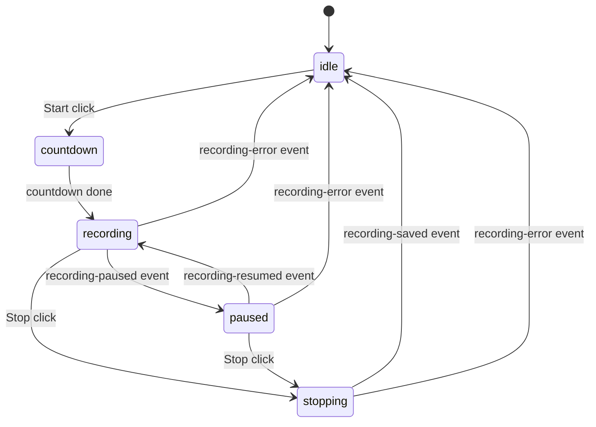

# Frontend and Backend Contract

This document is the source of truth for the React <-> Rust boundary.

## Contract Principles

- React does not call Tauri `invoke` directly from random components. Use `src/tauri/commands.ts`.
- React listens through `src/tauri/events.ts` wrappers.
- DTO fields must remain aligned between:
  - `src/types/index.ts` (TypeScript)
  - `src-tauri/src/models.rs` and Drive structs (Rust)

## Command Semantics

Many commands are synchronous request/response (`get_settings`, `list_capture_devices`, etc).

`start_recording` and `stop_recording` are asynchronous spawn flows: invoke resolves before final success/failure is known.

## Command List

| TS wrapper | Rust command | Behavior |
| --- | --- | --- |
| `startRecording(options)` | `start_recording` | Kicks off recording task; result arrives via events. |
| `pauseRecording()` | `pause_recording` | Pauses recording writes and emits `recording-paused`. |
| `resumeRecording()` | `resume_recording` | Resumes writes and emits `recording-resumed`. |
| `stopRecording()` | `stop_recording` | Kicks off stop/finalize/upload flow; status arrives via events. |
| `getSettings()` | `get_settings` | Load persisted settings or default if absent. |
| `getDefaultSettings()` | `get_default_settings` | Return canonical defaults (`AppSettings::default()`). |
| `listCaptureDevices()` | `list_capture_devices` | Return mics/cameras plus selected defaults. |
| `updateSettings(settings)` | `update_settings` | Persist settings and emit `settings-updated`. |
| `authorizeGoogleDrive()` | `authorize_google_drive` | OAuth flow + token persistence + settings update emit. |
| `listGoogleDriveFolders()` | `list_google_drive_folders` | List owned/shared folders with dedup+sort. |
| `listGoogleDriveVideos()` | `list_google_drive_videos` | List videos for selected folder newest-first. |
| `showNativeNotification(title, message)` | `show_native_notification` | macOS native notification path (`osascript`). |
| `toggleSettingsWindow()` | `toggle_settings_window` | Show/hide settings window and focus when shown. |
| `setCameraOverlayVisible(visible)` | `set_camera_overlay_visible` | Start/stop camera preview and show/hide camera window. |
| `toggleImmersiveMode()` | `toggle_immersive_mode` | Toggle immersive runtime state. |
| `setImmersiveMode(enabled)` | `set_immersive_mode` | Set immersive runtime state. |
| `toggleMicrophoneDuringRecording(enabled)` | `toggle_microphone_during_recording` | Intentionally unsupported; returns error. |
| `setMicMuted(muted)` | `set_mic_muted` | Runtime mic mute control. |
| `setSystemAudioMuted(muted)` | `set_system_audio_muted` | Runtime system-audio mute control. |
| `updateImmersiveShortcut(shortcut)` | `update_immersive_shortcut` | Persist shortcut + rebind menu/hotkey + emit shortcut update. |

## Event List

| Event | Payload | Producer | Consumer intent |
| --- | --- | --- | --- |
| `recording-started` | `{ startedAtMs, elapsedMs }` | backend | recording actually began |
| `recording-paused` | `{ elapsedMs }` | backend | confirm pause |
| `recording-resumed` | `{ elapsedMs }` | backend | confirm resume |
| `recording-stopped` | `{ elapsedMs }` | backend | capture stopped, finalization may continue |
| `recording-saved` | `{ path }` | backend | local finalized file is ready |
| `recording-error` | `{ message }` | backend | terminal error for session |
| `recording-elapsed` | `{ elapsedMs }` | backend | periodic timer tick |
| `camera-frame` | `CameraFrame` | backend | live camera preview frame |
| `camera-error` | `{ message }` | backend | camera preview issue |
| `drive-upload-pending` | `{ name }` | backend | upload started |
| `drive-upload-complete` | `{ id, name, webViewLink }` | backend | public link ready and processing complete |
| `drive-upload-error` | `{ message }` | backend | upload/share flow error |
| `settings-updated` | `AppSettings` | backend | persisted settings changed |
| `immersive-shortcut-updated` | `{ shortcut }` | backend | hotkey value changed |
| `immersive-mode-changed` | `{ enabled }` | backend | immersive runtime state changed |

## AppSettings DTO

```ts
interface AppSettings {
  micEnabled: boolean
  cameraEnabled: boolean
  microphoneDeviceId?: string
  cameraDeviceId?: string
  hideWebcamOnImmersiveMode: boolean
  immersiveShortcut: string
  saveRecordingsLocally: boolean
  saveLocation?: string
  googleDrive: {
    enabled: boolean
    clientId?: string
    folderId?: string
    folderName?: string
    accountEmail?: string
    accessToken?: string
    refreshToken?: string
    tokenExpiresAtMs?: number
  }
}
```

## UI State Machine (Overlay)



## Practical Rules

- Do not assume invoke success means workflow success.
- Emit new backend events before building UI that depends on backend async milestones.
- Keep error messages intact when they carry backend detail (especially Drive/OAuth).
