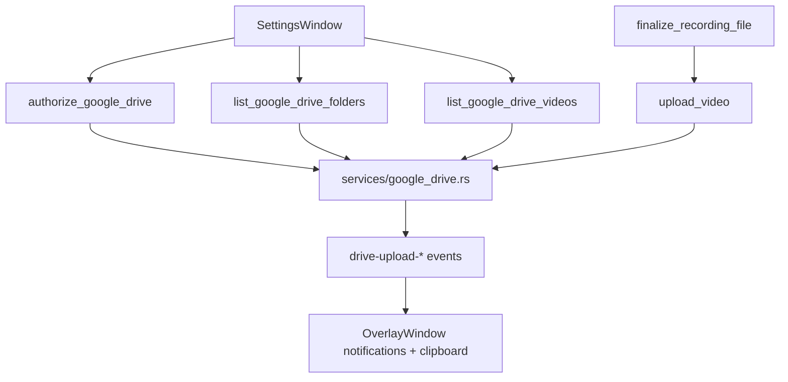
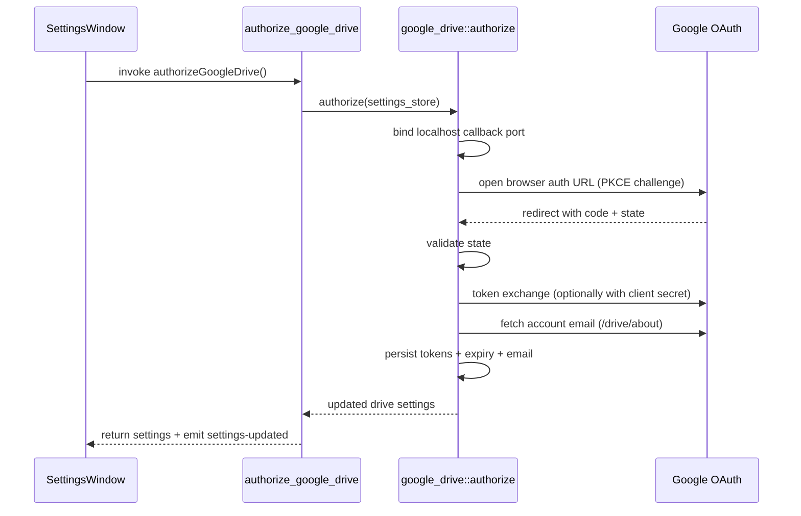
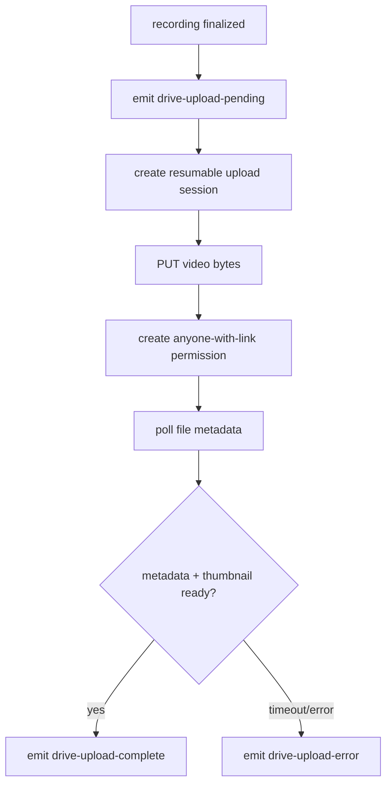

# Google Drive Integration

This document covers the implemented Drive architecture and user flow.

## Scope

Implemented capabilities:

- OAuth authorization/re-authorization
- persistent token storage in app settings
- folder discovery for selection
- video listing for selected folder
- upload on recording completion
- automatic public-link permissions
- readiness-gated completion event

## Architecture

## Settings Fields

Drive-related persisted fields:

- `googleDrive.enabled`
- `googleDrive.folderId`
- `googleDrive.folderName`
- `googleDrive.accountEmail`
- `googleDrive.accessToken`
- `googleDrive.refreshToken`
- `googleDrive.tokenExpiresAtMs`

Related global field:

- `saveRecordingsLocally`

## OAuth Flow (PKCE + localhost callback)

## Token Lifetime Handling

- Access token is used if not near expiry.
- If expired/near expiry, refresh token flow is triggered.
- Refreshed access token and new expiry are persisted.

## Folder Listing Behavior

Folder queries include:

- standard folder query
- `sharedWithMe` folder query
- all-drives support flags

Results are:

- de-duplicated by folder ID
- sorted by lowercased name

## Video Listing Behavior

`list_google_drive_videos`:

- requires selected folder ID
- filters videos in folder only
- returns newest-first
- includes `webViewLink` and `thumbnailLink`

## Upload + Share Lifecycle

Readiness gate avoids notifying success before Drive has processed the video enough for real sharing behavior.

## Frontend UX Wiring

Settings window:

- toggle Drive on/off
- toggle local-save on/off
- authorize/re-authorize button
- folder combobox with search + refresh
- public videos page with thumbnail + copy link + copied feedback

Overlay window:

- `drive-upload-pending` -> native notification: "Your video will soon be ready to be shared"
- `drive-upload-complete` -> copy link to clipboard + notification
- `drive-upload-error` -> error notification

## Current Security Posture

The current dev flow can include `GOOGLE_CLIENT_SECRET` in desktop builds via compile-time env injection. This is explicitly non-production-safe.

Read [Dangers](./DANGERS%20%E2%9D%8C.md) before changing scope, distribution, or auth model.
