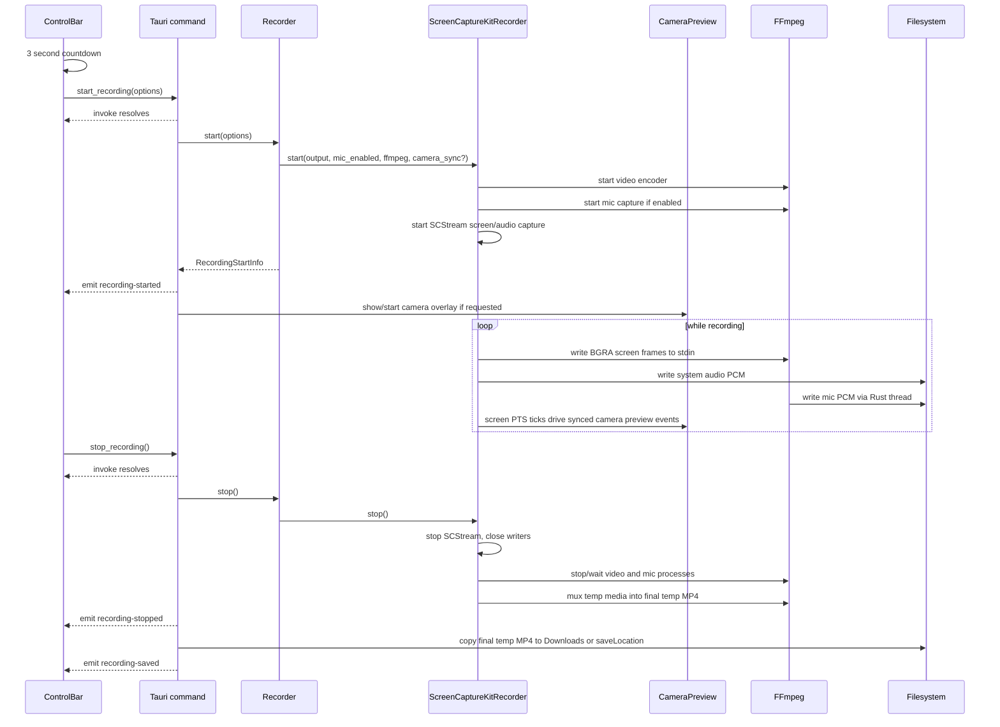
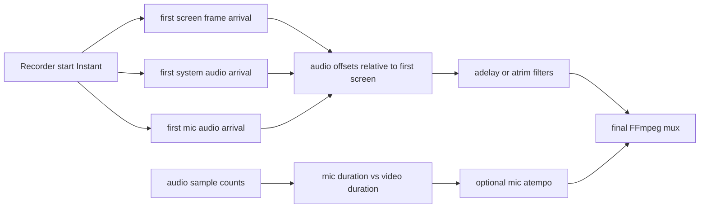

# Recording Pipeline

This is the most important part of the application. Momentum combines four media concerns:

- screen video
- system audio
- microphone audio
- webcam preview

They are not all captured the same way, and they do not all become independent tracks in the output file.

## End-to-End Flow



## Start Options

The frontend sends `RecordingOptions`:

```ts
{
  includeMicrophone: boolean
  includeCamera: boolean
  screenTarget?: string
}
```

Current behavior:

- `includeMicrophone` is read once at start. The app intentionally rejects toggling microphone source inclusion mid-recording.
- `includeCamera` controls whether camera sync is enabled and whether the overlay should be visible at recording start.
- `screenTarget` exists in TypeScript/Rust types but is not implemented. The recorder always chooses the first display returned by ScreenCaptureKit.

## Screen Video

Implementation files:

- `src-tauri/src/services/platform/screencapturekit_recorder/start.rs`
- `src-tauri/src/services/platform/screencapturekit_recorder/frame_handler.rs`

Screen capture uses `SCShareableContent::get()`, picks the first display, builds an `SCContentFilter`, and starts an `SCStream`.

The stream configuration:

- width and height: display dimensions
- frame interval: `CMTime::new(1, 30)`, effectively 30 FPS target
- pixel format: BGRA
- audio capture: enabled on the same stream
- audio sample rate: 48000
- audio channels: 2

Screen frames arrive in `FrameHandler::did_output_sample_buffer` as `SCStreamOutputType::Screen`.

Frame processing:

1. Store first screen frame arrival time for later audio alignment.
2. Convert the CoreMedia presentation timestamp to nanoseconds.
3. Send the screen PTS to `CameraSyncHandle` if camera sync is active.
4. If paused, return without writing the frame.
5. Lock the pixel buffer and write raw BGRA bytes to FFmpeg stdin.

The video encoder FFmpeg command is assembled as:

```text
ffmpeg -y -hide_banner -loglevel warning
  -f rawvideo -pix_fmt bgra -s WIDTHxHEIGHT -r 30 -i pipe:0
  -vf scale=EVEN_WIDTH:EVEN_HEIGHT
  -pix_fmt yuv420p
  -c:v libx264 -preset ultrafast -crf 23
  -an -movflags +faststart
  TEMP_VIDEO.mp4
```

The temporary screen video has no audio. The final MP4 is produced later by muxing.

## System Audio

System audio is captured from the ScreenCaptureKit stream, not by BlackHole and not by a separate FFmpeg input in the current code.

Audio frames arrive in the same `FrameHandler::did_output_sample_buffer`, but with `SCStreamOutputType::Audio`.

Processing:

1. Store first system-audio arrival time for later alignment.
2. Detect channel count from the `AudioBufferList`; default sample rate to 48000 Hz.
3. If paused, return without writing audio.
4. Read Float32 audio samples from the buffer list.
5. Detect whether the layout is planar or interleaved.
6. Convert Float32 samples to signed 16-bit little-endian PCM.
7. If system audio is muted, zero the PCM bytes before writing.
8. Write raw PCM to `sck_sysaudio_<session>.raw`.

The raw file has no header. The sample rate and channel count are carried in Rust state and passed to the final mux command.

## Microphone Audio

Microphone audio is separate from ScreenCaptureKit. If `includeMicrophone` is true, `start.rs` resolves the built-in mic index and starts an FFmpeg AVFoundation process:

```text
ffmpeg -y -hide_banner -loglevel warning
  -f avfoundation -i :MIC_INDEX
  -ac 2 -ar 48000
  -f s16le -
```

FFmpeg writes raw PCM to stdout. A Rust thread reads stdout and writes to `sck_mic_<session>.raw`.

Processing in the mic thread:

1. Store first microphone arrival time for later alignment.
2. If paused, keep reading but do not write the data.
3. If microphone is muted, zero the captured PCM chunk.
4. Write raw PCM to the mic temp file.
5. Count samples for drift estimation.

This design keeps the FFmpeg mic process alive while paused so capture resumes without process restart, but paused audio is dropped rather than represented as silence.

## Camera Preview and Camera Sync

Implementation file: `src-tauri/src/services/camera.rs`.

The webcam path is a preview path, not a muxed media track.

When camera preview starts, Rust resolves the camera index and starts FFmpeg:

```text
ffmpeg -f avfoundation -framerate 30 -video_size 640x480
  -i CAMERA_INDEX:
  -vf fps=30
  -f image2pipe -vcodec mjpeg -q:v 3 -
```

Rust parses JPEG frames from stdout, base64 encodes each JPEG, assigns a `ptsNs` timestamp using `mach_absolute_time`, and pushes the frame into `CameraSyncHandle`.

There are two camera emission modes:

- Sync disabled: each incoming camera frame is emitted immediately as a `camera-frame` event.
- Sync enabled: camera frames are buffered, and screen frame PTS ticks choose which camera frame to emit.

Sync is enabled only while recording with camera included. `FrameHandler` calls `emit_for_screen_pts(screen_pts_ns)` for each screen frame. The sync handle chooses the latest camera frame whose timestamp is at or before the adjusted screen timestamp, emits it to the camera overlay window, and adapts its target offset to keep camera preview lag bounded.

Important implication:

- The final recording does not contain a separate webcam video stream.
- The final recording shows the camera only if the `camera-overlay` window is visible and ScreenCaptureKit captures that window as part of the display.
- If immersive mode hides the camera overlay, the camera will not be visible in the captured screen even if camera preview is still conceptually enabled.

## Pause and Resume

Pause is implemented with an atomic `recording_paused` flag and a separate elapsed clock.

When paused:

- Screen callback stops writing video frames.
- System audio callback stops writing audio.
- Mic thread keeps reading FFmpeg stdout but skips writing captured chunks.
- Camera preview can continue emitting frames to the overlay, but screen frames are not written.
- The elapsed timer stops advancing because `RecordingClock` pauses.

When resumed:

- The paused flag is cleared.
- Screen, system audio, and mic writing resume.
- The elapsed timer resumes.

The implementation does not ask ScreenCaptureKit or FFmpeg to pause natively. It filters writes in Rust.

## Mute Controls

Mute and source inclusion are different concepts.

| Control | Can change during recording? | Implementation |
| --- | --- | --- |
| Include microphone source | No | `includeMicrophone` is captured at start. `toggle_microphone_during_recording` returns an error. |
| Mic mute | Yes | Rust zeroes mic PCM chunks before writing them. |
| System audio mute | Yes | Rust zeroes system-audio PCM before writing it. |

The mute flags live in `ScreenCaptureKitRecorder` as atomics:

- `mic_muted`
- `system_audio_muted`
- `recording_paused`

## Stop and Final Mux

Stopping is a multi-step operation in `stop.rs`:

1. Take and clear the active `RecordingState`.
2. Stop ScreenCaptureKit capture.
3. Sleep briefly so callbacks can finish.
4. Close video and system-audio writers.
5. Wait for video FFmpeg to finish, killing it after a timeout.
6. Stop mic FFmpeg with SIGINT if it is running, then kill after a timeout.
7. Compute statistics and timeline offsets.
8. Run `mux_final_video`.
9. Remove temporary video, system audio, and mic files.

The mux function builds an FFmpeg command with:

- input 0: temporary H.264 MP4 video
- input 1: raw system PCM if present
- input 2: raw mic PCM if present

For audio, it applies:

- `adelay` when an audio stream starts after the first screen frame
- `atrim=start=...` when an audio stream starts before the first screen frame
- mic `atempo` if mic duration differs enough from approximate video duration
- optional mic gain using `MIC_VOLUME_GAIN` from `services/mod.rs`
- `amix` when both system and mic audio are present
- `aresample=async=1000:first_pts=0`
- `atrim=duration=<video_duration>`
- `alimiter=limit=0.97`

The output maps copied video plus one AAC audio stream:

```text
ffmpeg -i TEMP_VIDEO.mp4
  [-f s16le -ar SYS_RATE -ac SYS_CHANNELS -i SYS_AUDIO.raw]
  [-f s16le -ar MIC_RATE -ac MIC_CHANNELS -i MIC_AUDIO.raw]
  -filter_complex FILTER_GRAPH
  -map 0:v -map [aout]
  -c:v copy -c:a aac -b:a 128k -shortest
  -movflags +faststart
  FINAL_TEMP_OUTPUT.mp4
```

If muxing fails, the stop path attempts to fall back to video-only output.

## Timeline Model

The screen timeline is the anchor.



The implementation records first-arrival timestamps using `Instant::elapsed()` from the capture start. Those timestamps are not media PTS values, but they are used as practical alignment markers.

The camera sync path uses CoreMedia screen presentation timestamps and mach host timestamps for preview emission. That sync affects the live overlay display; final output still depends on the overlay being captured as screen content.

## Temporary Files

During capture:

- `sck_video_<id>.mp4`: H.264 screen video with no audio.
- `sck_sysaudio_<id>.raw`: raw s16le system audio.
- `sck_mic_<id>.raw`: raw s16le microphone audio, only if mic was enabled.

Recorder-level final temp output:

- `momentum_screen_<uuid>.mp4`

User-visible output:

- `momentum-recording-<unix_seconds>.mp4`
- saved under `settings.saveLocation` or the macOS Downloads directory.

## Known Architectural Constraints

- Only the first ScreenCaptureKit display is captured.
- The TypeScript/Rust `screenTarget` option is not used.
- The camera is not composited into the video pipeline. It is only captured if the camera overlay window is visible on the captured display.
- Pause is implemented by dropping writes, not by preserving timeline gaps as silence or duplicate frames.
- Device selection is opinionated: built-in mic and built-in camera are preferred by the Swift resolver.
- FFmpeg must be available at runtime.
