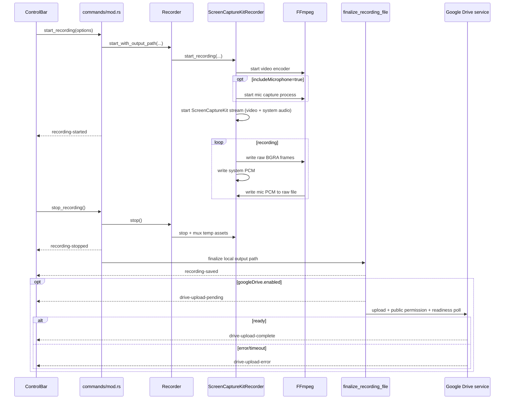
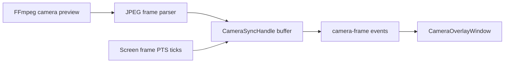

# Recording Pipeline

This document explains exactly how recording works from click to final file and optional Drive share.

## Media Inputs and What They Become

- Screen video: captured by ScreenCaptureKit, encoded by FFmpeg.
- System audio: captured by ScreenCaptureKit audio callbacks, written to raw PCM.
- Microphone audio: captured by separate FFmpeg AVFoundation process, written to raw PCM.
- Camera: preview-only pipeline rendered in a window; not a dedicated muxed track.

## End-to-End Sequence

## Start Path Details

### 1) Output destination guard

Before starting, backend checks:

- `saveRecordingsLocally == true`, or
- `googleDrive.enabled == true`

If both are false, start fails with: `Enable local saving or Google Drive before recording.`

### 2) Staging path

A hidden staging file path is generated:

- `.momentum-recording-<seconds>-<millis>.inprogress.mp4`

If local save is enabled, path is in output dir; otherwise temp dir is used.

### 3) Screen capture + encode

ScreenCaptureKit captures first display. Frames are pushed into FFmpeg via stdin.

Current encoder flags include:

- `-c:v libx264`
- `-preset veryfast`
- `-crf 23`
- `-profile:v high`
- `-level 4.2`
- `-g 60 -keyint_min 30 -bf 2`
- `-pix_fmt yuv420p`
- `-movflags +faststart`

## Audio Path Details

### System audio

- Received from ScreenCaptureKit audio callback.
- Float32 samples converted to s16le.
- Written to `sck_sysaudio_<id>.raw`.
- When system mute is active, bytes are zeroed before write.

### Microphone audio

- FFmpeg AVFoundation process records selected mic index.
- Writes raw s16le PCM to `sck_mic_<id>.raw`.
- During pause: process continues reading but skips writes.
- During mic mute: chunk is zeroed before write.

## Camera Preview + Sync

Camera is captured by a separate FFmpeg preview process emitting JPEG frames.

If sync is enabled (recording with camera included), the sync handle emits camera frames based on screen PTS timing. This fixed prior frozen-frame startup behavior.

## Pause/Resume Model

Pause is implemented as write filtering, not process pause:

- callbacks still fire
- FFmpeg mic process still runs
- writes are skipped while paused
- elapsed clock is paused in recorder state

## Stop and Finalization

On stop:

- recorder stops capture and closes writers/processes
- temporary media assets are muxed into output MP4
- final file is moved/renamed into visible output name
- `recording-saved` event emitted

Final visible name:

- `momentum-recording-<unix_seconds>.mp4`
- suffixes are added if collision occurs

## Drive Integration Hook In Stop Path

After local finalization:

- if Drive enabled: upload lifecycle begins
- if local saving disabled: local file is removed after upload attempt
- completion event is emitted only after Drive readiness check succeeds

Readiness currently requires both:

- video metadata available (`durationMillis` or dimensions)
- thumbnail available

This delays success notification until link is practically usable.
